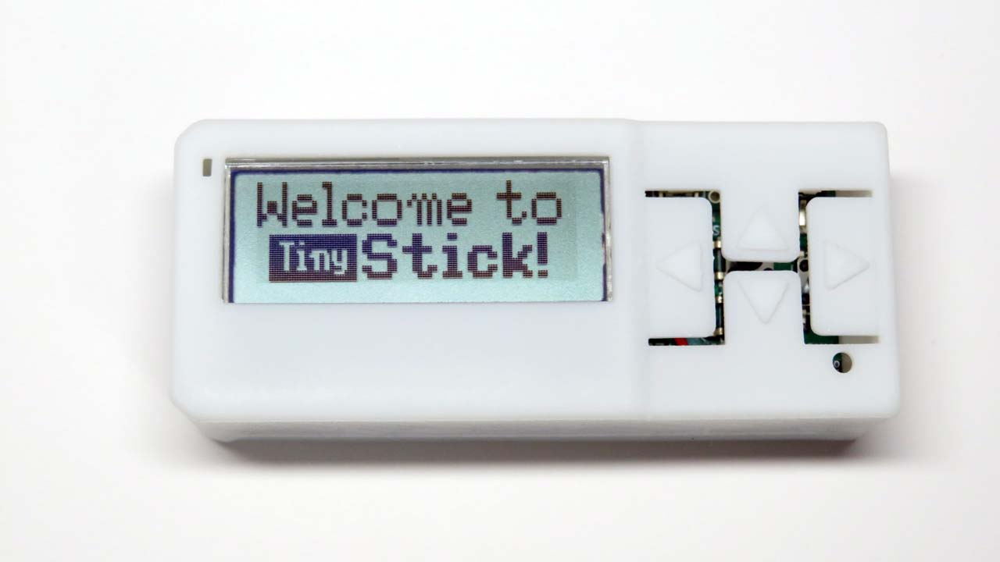

# TinyStick

**TinyStick**は、**ATtiny3217**(32KB Flash, 2KB SRAM, 256B EEPROM)を搭載した、Arduino互換の開発キットです。消費電流は約4.5mA(クロック10MHz。スリープ時は0.1mA未満)と小さく、コイン電池で長期間動作します。プログラムの書き込みは、付属の**USBシリアル変換基板**(CH340E搭載)で行います。詳しくは、 [tinystick.jp](https://www.tinystick.jp)をご覧ください。

# コンテンツ
- **Arduino** 
PlatformIOでビルドできるデモのソースコードです。
- **KiCad** 
[KiCad](https://www.kicad.org/)(7.0)のプロジェクトです。TinyStick本体の**TS_Core.kicad_pro**と、USBシリアル変換基板の**TS_USB.kicad_pro**が含まれます。
- **schematic** 
TinyStick本体とUSBシリアル変換基板の回路図PDFです。
- **Blender** 
3Dプリントケース作成用のBlenderのプロジェクトファイルと、発注に使用したSTLファイルです。

# プログラミング
**TinyStick**のプログラミングは、[PlatformIO](https://platformio.org/)で行います。[Arduino IDE](https://www.arduino.cc/en/software)は、2.3版ではTinyAVR用のボードマネージャーの定義が読み込めない等の理由で推奨しません。(→[参考](https://ameblo.jp/pta55/entry-12835016734.html))

### ビルド
- **PlatformIO**のプロジェクトフォルダに**Arduino**以下をコピーし、適当な名前(例:TinyStickDemo)に変更します。
- **PlatformIO**の**Home**画面から[**Open Project...**]で、このプロジェクトを開きます。
- 必要なplatform(**Atmel megaAVR**)のインストールが自動的に始まります。
- インストールが完了したら**Build**してください。

### UPDI書き込み
- USBシリアル変換基板をUSBケーブルで接続して、スイッチをオンします(赤いLEDが光ります)。このとき、ドライバを自動認識しない場合は、[メーカーのHP](https://wch-ic.com/search?q=CH340&t=downloads)からCH340のドライバをダウンロードしてインストールしてください。
- Windowsの場合は、デバイスマネージャの「ポート(COMとLPT)」に「USB-SERIAL CH340 (COMxx)」と表示されれば完了です。
- **PlatformIO**の**Upload**をクリックすると、プログラムを転送します。

### シリアルデバッグ
- 横のボタン(**Button5**)を押して「Bounce Ball」デモに切り替えたあと、**PlatformIO**の**Serial Monitor**または**Tera Term**等のターミナルアプリを起動すると、加速度の数値が流れてきます。
- このUSBシリアル変換基板は、ターミナルアプリを起動するとRTS信号がLOWになることを利用して、UPDI書き込みとシリアル通信モードを自動的に切り替えます。(Windowsで確認 →[参考](https://ehbtj.com/electronics/make-serial-updi-programmer/))

### platformio.ini
プロジェクトのルートにある設定ファイルです。重要な項目について説明します。

`board_build.f_cpu = 10000000` 
CPUクロックを設定します。初期値は10MHz、最大は20MHzです。必ず5の倍数にしてください。そうしないとシリアル通信が文字化けします。また5MHzにすると、I2Cが正常に動作しません。記述しないと16MHzになります。

### ソースコード
- **main.cpp** 
メインプログラムで、初期化、タイトル表示、サイドボタン(**Button5**)によるデモの切り替え、長押しによるバックライトのオンオフを処理します。

- **TinyStickDef.h** 
共通の#define、ピン定義です。

- **TinyStick.h .cpp** 
ボタン、圧電ブザーのクラス、スリープ関連のグローバル関数です。

- **TinyLCD.h .cpp** 
バックライト付きLCD [**AQM1248A**](https://akizukidenshi.com/catalog/g/g110048/)に、ビットマップまたは文字を表示するクラスです。文字は、拡大・ボールド・白黒反転・縦・プロポーショナル表示に対応しています。

- **font8x8.h** 
8x8ドットフォントです。0x20から0x7Fまでの英数記号です。

- **TinyApp.h .cpp** 
複数のアプリを切り替えるときは、このクラスの派生クラスを作成して**main.cpp**に定義するだけで、サイドボタン(**Button5**)で切り替えられます。

- **I2Cbase.h .cpp** 
本体内蔵の加速度センサ(**LIS2DH12**)と、M5StickC用のENV Hat(**SHT30**)の基底クラスです。

- **octave.h** 
ドレミの周波数を定義したファイルです。

- **playDigit.h .cpp** 
２桁の整数値をドレミの音程で鳴らす関数です。

- **app/** 
6つのデモアプリです。**TinyApp**の派生クラスです。
  - **EnvHat.h .cpp** 
  **ENV Hat**で温度/湿度を表示します。**Button1**で次のアプリに切り替えます。装着されていないときはスキップします。

  - **KitchenTimer.h .cpp** 
  キッチンタイマーです。最大99分。スタートすると、分をEEPROMに保存します。

  - **AccelDemo.h .cpp** 
  加速度センサのデモです。傾けると玉が転がります。

  - **FontTest.h .cpp** 
  8x8ドットフォントをダンプします。**Button1**で拡大、**Button2,3**でスクロールします。

  - **Tetris.h .cpp** 
  お馴染みのゲームで、縦向きで遊びます。

  - **Maze3D.h .cpp** 
  Line関数を利用した3次元迷路です。

### スリープ機能
一定時間のスリープが出来ます。いずれかのボタンを押すと、スリープから復帰します。
- 時間は任意の時間ではなく、**TinyStick.h**の`enum SleepTime`の時間しか設定できません。
- 本来PX2,PX6ピンに接続されたボタン(TinyStickではButton1のみ)でしかスリープからの復帰はできませんが、これは**FALLING**モードの場合で、**LOW**モードならどのボタンでも復帰が可能です。このため、**LOW**モードでスリープし、起きたら**FALLING**モードに変更して、連続して割り込みが入らないようにしています。